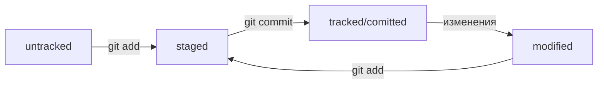

# Shortcuts 

---

## Инициализация репозитория 

* git init

---

## Удаление репозитория

* rm -rf .git

---

## Добавление файла в репозиторий 

* git add somefile.txt
* git add --all (всё содержимое папки)
* git add. (добавить всю текущую папку) 

---

## Создать коммит

* git commit -m 'название'

---

## История коммитов

* git log

---

## Связать локальный и удалённый репозиторий

* git remote add origin git@github.com:%ИМЯ\_АККАУНТА%/first-project.git

---

## Убедиться, что репозитории связаны

* git remote -v

---

## Делаем гит-пуш

* git push -u origin main

---

# Cправочник

## Хеш — идентификатор коммита
* Хеширование (от англ. hash, «рубить», «крошить», «мешанина») — это способ преобразовать набор данных и получить их «отпечаток» (англ. fingerprint).
* Хеш — основной идентификатор коммита

---

## Элементы описания коммита. Git log
Разберём элементы, из которых состоит описание:
* cтрока из цифр и латинских букв после слова commit — это хеш коммита;
* Author — имя автора и его электронная почта;
* Date — дата и время создания коммита;
* в конце находится сообщение коммита

Получить сокращённый лог — git log --oneline

---

## HEAD 

* Файл HEAD — один из служебных файлов папки .git. Он указывает на коммит, который сделан последним (то есть на самый новый).
* Внутри HEAD — ссылка на служебный файл: refs/heads/master (или refs/heads/main в зависимости от названия ветки). Если заглянуть в этот файл, можно увидеть хеш последнего коммита.

---

## Статусы файлов в GIT 
Статусы untracked/tracked, staged и modified
* untracked - Git «видит», что такой файл существует, но не следит за изменениями в нём.
* Staged - файл попадает в staging area, то есть в список файлов, которые войдут в коммит.
* tracked - это противоположность untracked. Оно довольно широкое по смыслу: в него попадают файлы, которые уже были зафиксированы с помощью git commit
* modified - Git сравнил содержимое файла с последней сохранённой версией и нашёл отличия.

Типичный жизненный цикл файла в Git

